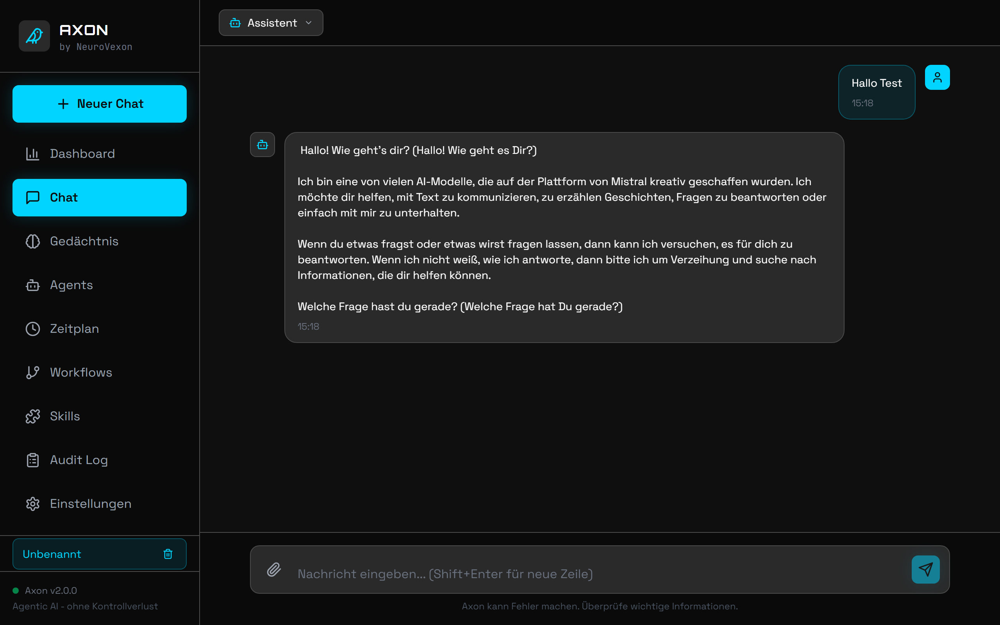

<p align="center">
  
</p>

<h1 align="center">AXON</h1>

<p align="center">
  <strong>Agentic AI — without losing control.</strong>
</p>

<p align="center">
  The open-source AI agent platform where every action requires your approval.
</p>

<p align="center">
  <a href="LICENSE">
    
  </a>
  <a href="https://github.com/NeuroVexon/axon-community/stargazers">
    
  </a>
  <a href="https://github.com/NeuroVexon/axon-community/actions/workflows/ci.yml">
    
  </a>
  
</p>

<p align="center">
  <a href="#-why-axon">Why AXON?</a> &bull;
  <a href="#-key-features">Features</a> &bull;
  <a href="#-quickstart">Quickstart</a> &bull;
  <a href="#-cli">CLI</a> &bull;
  <a href="#-docs">Docs</a> &bull;
  <a href="#-contributing">Contributing</a>
</p>

---

<p align="center">
  
</p>

## Why AXON?

AI agents today can read files, browse the web, execute shell commands, and send emails — **autonomously**. Most do it without asking. No approval. No audit log. No control.

**AXON does it differently:**

- Every action is shown **before execution** — tool name, parameters, risk level
- You decide: **Allow**, **Reject**, or **Allow for Session**
- Complete **audit trail** of every action, exportable as CSV
- **100% on-premise** possible — no cloud required
- **GDPR-compliant** by design

## Key Features

| Feature | Description |
|---------|-------------|
| **Controlled Agent System** | Every tool call requires explicit approval with risk levels (low / medium / high) |
| **Multi-Agent** | Multiple agents with individual roles, models, and permissions |
| **Multi-LLM** | Ollama (local), Claude, OpenAI, Gemini, Groq, OpenRouter — switch anytime |
| **Audit Dashboard** | Full log of all actions — filterable, searchable, CSV export |
| **Code Sandbox** | Docker-based code execution with network isolation and memory limits |
| **MCP Server** | Use AXON as a controlled tool provider for Claude Desktop, Cursor, etc. |
| **Email Integration** | IMAP/SMTP with read-only inbox and approval-gated sending |
| **Scheduled Tasks** | Cron-based proactive tasks with approval gate |
| **Workflow Chains** | Multi-step automations with trigger phrases and step variables |
| **Document Upload** | Chat about PDFs, images, and code files |
| **Persistent Memory** | AI remembers facts across conversations |
| **Skills System** | Community plugins with hash-based security gate |
| **Telegram & Discord** | Messenger bots with inline approval buttons |
| **CLI** | Terminal control with SSE streaming, pipe support, and scripting |
| **Encrypted API Keys** | Fernet encryption in the database |
| **Docker Deployment** | One command to start everything |
| **Dark Theme** | Modern UI with cyan accents |

## Quickstart

### Docker (recommended)

```bash
git clone https://github.com/NeuroVexon/axon-community.git
cd axon-community

cp .env.example .env

docker-compose up -d

# Pull an LLM model (one-time)
docker exec axon-ollama ollama pull llama3.1:8b
```

**Open http://localhost:3000**

### Manual Installation

<details>
<summary>Backend</summary>

```bash
cd backend
python -m venv venv
source venv/bin/activate  # Windows: venv\Scripts\activate
pip install -r requirements.txt
cp ../.env.example .env
uvicorn main:app --reload
```
</details>

<details>
<summary>Frontend</summary>

```bash
cd frontend
npm install
npm start
```
</details>

## CLI

AXON ships with a full CLI for power users — SSE streaming, tool approval, and pipe support right in your terminal.

### Installation

```bash
pip install -e ./cli
axon chat "Hello"
```

### Commands

```bash
# Chat (SSE streaming with live output)
axon chat "message"                        # Single message
axon chat --agent Research "message"       # With specific agent
axon chat --session <id> "message"         # Continue session
cat file.txt | axon chat                   # Pipe support

# Interactive mode
axon                                       # Start REPL

# Agents
axon agents                                # List all agents
axon agents show <name>                    # Agent details

# Memory
axon memory list                           # All memories
axon memory search "query"                 # Search memory
axon memory add "key" "content"            # Add memory
axon memory delete <id>                    # Delete memory

# System
axon status                                # Health check + stats
axon version                               # CLI + server version
```

### Tool Approval

When the agent wants to use a tool, you get an approval prompt:

```
╭─ Tool Request ───────────────────────────╮
│ Tool:   web_search                       │
│ Risk:   low                              │
│                                          │
│   query: Python tutorials                │
╰──────────────────────────────────────────╯
[A]llow  [S]ession  [R]eject  > a
```

## Available Tools

| Tool | Description | Risk |
|------|-------------|------|
| `file_read` | Read a file | Medium |
| `file_write` | Write a file (restricted to /outputs/) | Medium |
| `file_list` | List directory contents | Low |
| `web_fetch` | Fetch a URL | Medium |
| `web_search` | Web search (DuckDuckGo) | Low |
| `shell_execute` | Shell command (whitelist only) | High |
| `code_execute` | Run code in Docker sandbox | High |
| `memory_save` | Save a fact to memory | Low |
| `memory_search` | Search memory | Low |
| `memory_delete` | Delete a memory entry | Low |

## Configuration

```env
# LLM Provider: ollama, claude, openai, gemini, groq, openrouter
LLM_PROVIDER=ollama

# Ollama (local)
OLLAMA_BASE_URL=http://localhost:11434
OLLAMA_MODEL=llama3.1:8b

# Claude API (optional)
ANTHROPIC_API_KEY=sk-ant-...

# OpenAI API (optional)
OPENAI_API_KEY=sk-...

# Telegram Bot (optional)
TELEGRAM_BOT_TOKEN=123456:ABC...

# Discord Bot (optional)
DISCORD_BOT_TOKEN=MTIz...
```

See [docs/CONFIGURATION.md](docs/CONFIGURATION.md) for all options.

## Security

- **Shell Whitelist** — Only predefined commands, chaining blocked
- **File Restriction** — Write access limited to /outputs/, path traversal blocked
- **URL Validation** — SSRF protection (localhost, internal IPs, AWS IMDS blocked)
- **Encrypted API Keys** — Fernet encryption in SQLite
- **Skills Gate** — File hash verification, automatic revocation on change
- **Audit Trail** — Every action is logged
- **Code Sandbox** — Docker isolation, no network, memory limits

Found a vulnerability? See [SECURITY.md](SECURITY.md)

## Docs

- [Installation](docs/INSTALLATION.md)
- [Configuration](docs/CONFIGURATION.md)
- [CLI](docs/CLI.md)
- [Tools](docs/TOOLS.md)
- [Skills](docs/SKILLS.md)
- [Messenger Integration](docs/MESSENGER.md)
- [Security](SECURITY.md)
- [Testing](docs/TESTING.md)
- [API Reference](docs/API.md)
- [Changelog](CHANGELOG.md)
- [Third-Party Licenses](THIRD_PARTY_LICENSES.md)

## Contributing

Contributions are welcome! See [CONTRIBUTING.md](CONTRIBUTING.md).

1. Fork the repository
2. Create a feature branch (`git checkout -b feature/amazing-feature`)
3. Commit your changes (`git commit -m 'feat: add amazing feature'`)
4. Push to the branch (`git push origin feature/amazing-feature`)
5. Open a Pull Request

## License

**Apache License 2.0** — see [LICENSE](LICENSE)

| Usage | Allowed? |
|-------|----------|
| Private use | Yes |
| Commercial use | Yes |
| Modification | Yes |
| Distribution | Yes |
| Patent use | Yes |
| Warranty | Provided "as is" |

## Community

- [GitHub Discussions](https://github.com/NeuroVexon/axon-community/discussions)
- [GitHub Issues](https://github.com/NeuroVexon/axon-community/issues)
- Email: service@neurovexon.com

## Star History

[](https://star-history.com/#NeuroVexon/axon-community&Date)

---

<p align="center">
  <strong>AXON by NeuroVexon</strong><br>
  <em>Agentic AI — without losing control.</em>
</p>

<p align="center">
  Made with love in Germany
</p>
